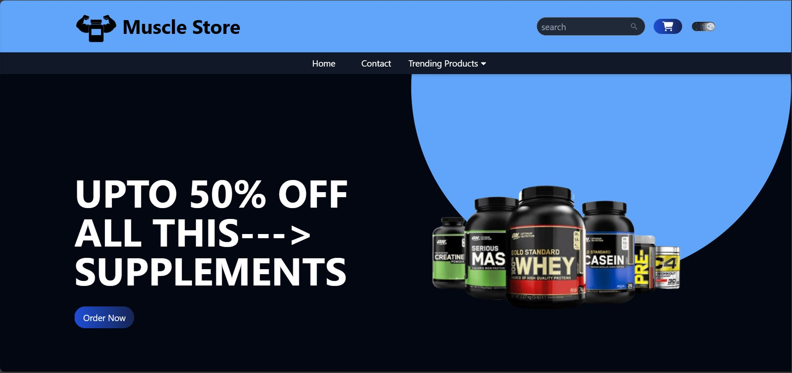
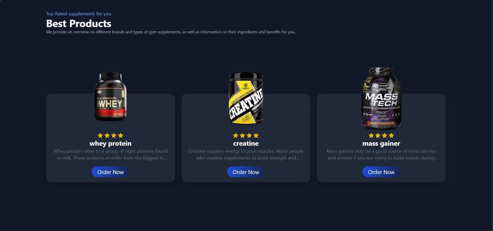

# 💪 Muscle Store

A modern, responsive React e-commerce UI for gym lovers and supplement brands. Designed to showcase products like whey, creatine, and mass gainers with style, clarity, and simplicity.

---

## 🚀 Live Demo

🔗 [Click here to visit the store](https://mohamed23220033.github.io/Muscle-Store)

---


<!DOCTYPE html>
<html lang="en">
<head>
  <meta charset="UTF-8" />
  <meta name="viewport" content="width=device-width, initial-scale=1.0"/>
  
  <style>
    body {
      font-family: Arial, sans-serif;
      background-color: #121212;
      color: #fff;
      text-align: center;
      padding: 20px;
    }

    h1 {
      color: #00bcd4;
    }

    img {
      max-width: 90%;
      height: auto;
      margin: 30px auto;
      border: 3px solid #00bcd4;
      border-radius: 10px;
      box-shadow: 0 0 20px rgba(0, 188, 212, 0.3);
      display: block;
    }

    .caption {
      margin-top: -20px;
      margin-bottom: 40px;
      font-size: 18px;
      color: #ccc;
    }
  </style>
</head>
<body>
  <h1>🖼️ UI Previews for Muscle Store Project </h1>

  
  <div class="caption">🏷️  Banner with Discount Offer</div>

  
  <div class="caption">⭐ Best Rated Products with Order Buttons</div>

  
  <div class="caption">📬 Email Subscription Section</div>

</body>
</html>


---

## 📦 Features

- 🌗 Light & Dark mode toggle
- 🛒 Add to Cart interface
- 🔍 Product filtering & browsing
- 💬 Call to action and newsletter sections
- 🧱 Component-based architecture with React

---

## 🧠 Why Muscle Store?

| Benefit              | Description                                                                 |
|----------------------|-----------------------------------------------------------------------------|
| 🚀 Fast Performance  | Optimized layout using functional React components                          |
| 📱 Mobile Friendly   | Responsive design for all devices                                           |
| 🔧 Easy to Maintain  | Clean and modular code for easy expansion                                   |
| 💅 Modern UI         | Uses modern design principles to attract fitness audiences                  |
| 💬 Informative Cards | Each product includes details, rating, and instant order button             |

---

## 🛠 Tech Stack

| Tech          | Description              |
|---------------|--------------------------|
| React JS      | Main UI framework        |
| HTML & CSS    | Structure and styling    |
| JavaScript    | Functionality & logic    |
| GitHub Pages  | Deployment platform      |

---

## 📊 Visual Insights

### 🧩 Component Relationship Diagram

```mermaid
graph TD;
    App --> Home
    Home--> Navbar
    Home -->|Routing| Home
    Home --> 
    Home --> FeaturedProducts
    Home --> SubscribeSection
    FeaturedProducts --> ProductCard
